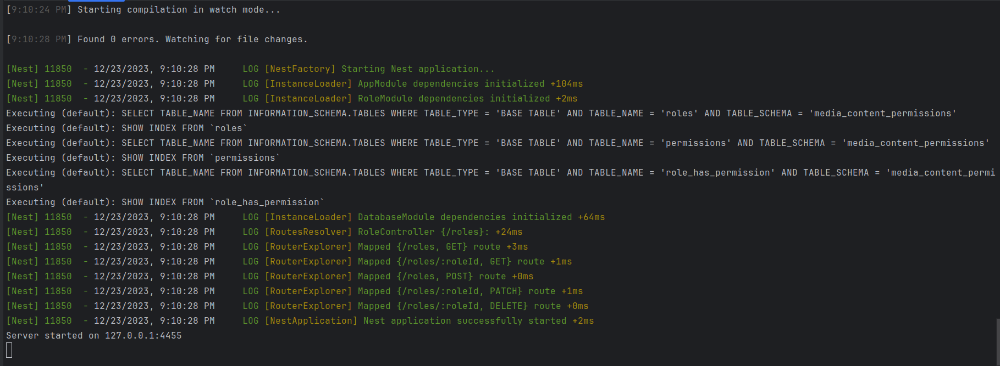
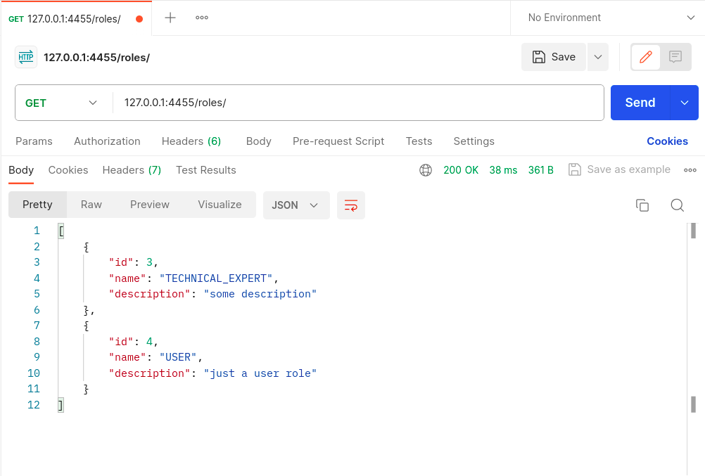
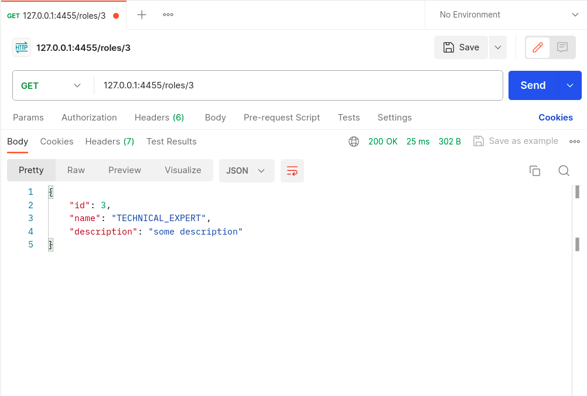
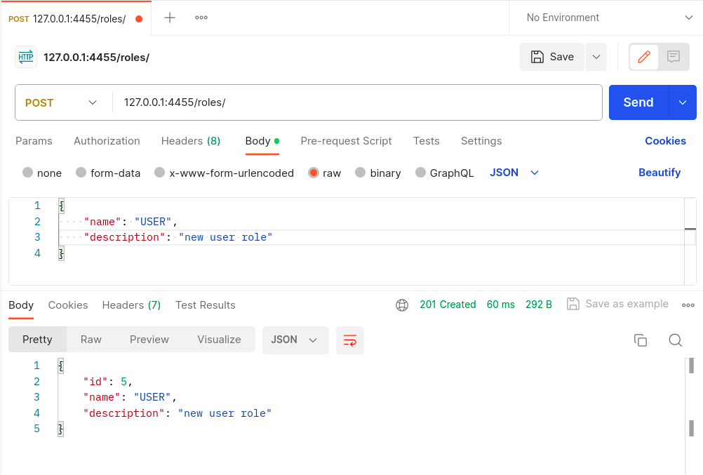
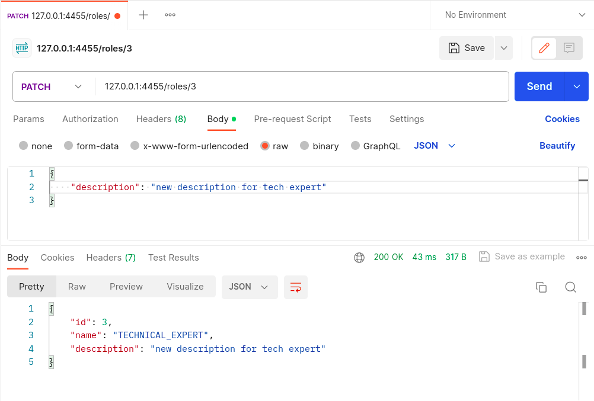
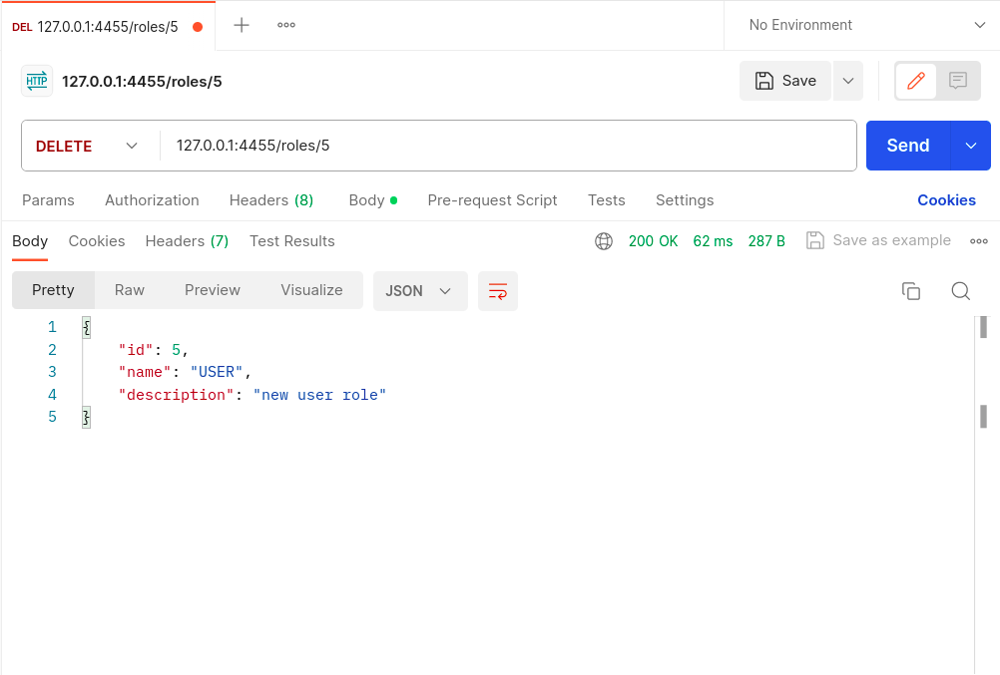
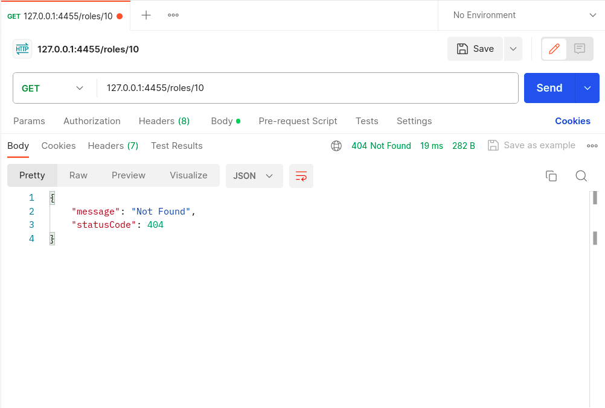

# Тестування працездатності системи

Сервіс протестований за допомогою Postman

## Запуск сервера

    

## GET /roles

    

## GET /roles/:roleId

    

## POST /roles

    

## PATCH /roles/:roleId

    

## DELETE /roles/:roleId

    

## Not Found

    

